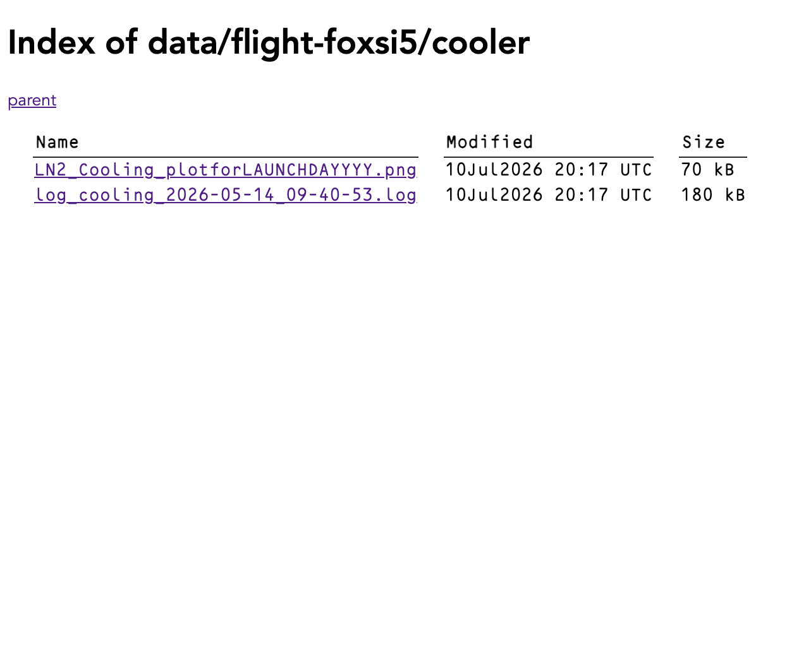

# What S3 is used for

S3 is an interface to object storage. Object storage just means dumping data somewhere on the internet.

In S3, you put data into _buckets_.

On FOXSI, we can fit all our calibration, test, and flight data in S3 without paying a dime. But S3 makes it tricky to browse that data or get it back out.

The tools in this folder are for working with data on S3 without too much effort. One tool in particular, [`make_s3_site.py`](make_s3_site.py), figures out what is inside a bucket and spits out an HTML site you can use to browse the bucket.

## What [`make_s3_site.py`](make_s3_site.py) is used for

This script:

1. Retrieves a full file listing from an S3 bucket of your choice.
2. Creates a static HTML website you can use to navigate the bucket.
3. Uploads the website back to the same bucket.
4. Updates permissions on the bucket to make it publicly readable.

The site that is created looks like this:


## Using [`make_s3_site.py`](make_s3_site.py)

This script depends on [`boto3`](https://docs.aws.amazon.com/boto3/latest/), a library exposing the S3 API, and you can install it using `pip` (and probably `conda` too).

### Credentials

In order to run this script, [`boto3` needs to see some ID](https://docs.aws.amazon.com/boto3/latest/guide/credentials.html). To find your ID—your access key and secret key—visit the [MSI credentials page](https://msi.umn.edu/storage/data-storage/second-tier-storage/s3-credentials).

On your computer (doesn't need to be on a UMN VPN or anything), create a directory for AWS configuration:

```console
$ mkdir $HOME/.aws/
```

Make a file in the directory:

```console
$ touch $HOME/.aws/credentials
```

Edit the `credentials` file so it looks like this, but with your keys instead:

```ini
[default]
aws_access_key_id = YOURACCESSKEY
aws_secret_access_key = yourVerySecretKeyAndMaybeSomeNumbers
```

> [!CAUTION]
> Don't put this file on Github!

Now when you use `boto3` it will use this file to authenticate you.

### Configuring

Make another file in the `$HOME/.aws` directory:

```console
$ touch $HOME/.aws/config
```

and edit it to contain this info:

```ini
[default]
request_checksum_calculation=when_required
response_checksum_validation=when_required
```

Without these checksum settings, uploads through S3 don't work [for some reason](https://github.com/boto/boto3/issues/4398).

### Permissions

There is a [byzantine system](https://docs.aws.amazon.com/AmazonS3/latest/userguide/using-with-s3-policy-actions.html) of [permissions](https://msi.umn.edu/storage/data-storage-faqs/how-do-i-use-s3-buckets-share-data-tier-2-storage-other-users) for users to interact in any way with S3.

Thanasi can provide some canned permissions files if that makes things easier.

### Before you run

At the top of [the script](make_s3_site.py) are four important variables:

1. `s3_bucket` is the S3 bucket name you want to read and write to.
2. `s3_site_path` is the path within the bucket you want to deposit the website files in. **NOTE:** if there is already data in this folder on S3, it may be overwritten!
3. `s3_data_folder` is the path within the bucket to search for data files. 
4. `dry_run`, if set to `True`, will only read from S3 but not write. You will still see all the printout.
5. `local_swap_folder` is the path on your own computer that the website will be temporarily stored in before it is uploaded. **NOTE:** if there is already data in this folder on your computer, it may be overwritten!

### Running

> [!CAUTION]
> Running this script will modify the data in the S3 bucket you specify. I don't want you to be unpleasantly surprised. The previous section covers what will change.

To build and upload the index website, just do this (assuming you're in the `storage-tools` root):

```console
$ python s3/make_s3_site.py
```

_(In the future, I will add some info about interactivity, logging, and daemon execution here.)_

## Issues

I have not been able to upload much data yet to S3 because of hitting some quotas imposed by MSI or AWS. I will try to figure it out.